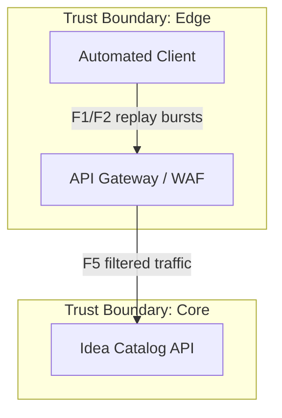

# P04 — Data Flow Diagram

Эта диаграмма описывает ключевые взаимодействия сервиса Idea Catalog в контексте модели угроз P04. Потоки помечены `F1…F12` и переиспользуются в таблицах STRIDE и реестре рисков.

## Основной контур

```mermaid
flowchart TB
  subgraph Client["Trust Boundary: Client"]
    PO[Product Owner Browser]
    EV[Evaluator Browser]
    AD[Admin Console]
  end

  subgraph Edge["Trust Boundary: Edge"]
    GW[API Gateway / WAF]
  end

  subgraph Core["Trust Boundary: Core"]
    API[Idea Catalog API (FastAPI)]
  end

  subgraph Data["Trust Boundary: Data"]
    STORE[(Idea Data Store)]
    LOGS[(Security Log Sink)]
    VAULT[(Secrets Vault / KMS)]
  end

  subgraph Ops["Trust Boundary: CI/CD"]
    CI[CI Runner]
    SCAN[Dependency Scanner<br/>pip-audit]
  end

  PO -->|F1: HTTPS POST /ideas| GW
  EV -->|F2: HTTPS POST /ideas/{id}/evaluations| GW
  PO -->|F3: HTTPS GET /ideas| GW
  AD -->|F4: HTTPS PATCH /ideas/{id} (JWT)| GW

  GW -->|F5: Internal HTTP + JWT claims| API
  API -->|F6: CRUD ideas/evaluations| STORE
  STORE -->|F7: Idea records| API
  API -->|F8: Push 401/403 security events| LOGS
  API -->|F9: Request secrets| VAULT
  VAULT -->|F10: Rotate short-lived tokens| API

  CI -->|F11: Schedule pip-audit job| SCAN
  SCAN -->|F12: Vulnerability report| CI
```

## Альтернативный сценарий



Альтернативный сценарий иллюстрирует автоматизированный трафик (бот или нагрузочный агент), где критична фильтрация и rate limiting на `F1/F2`.
